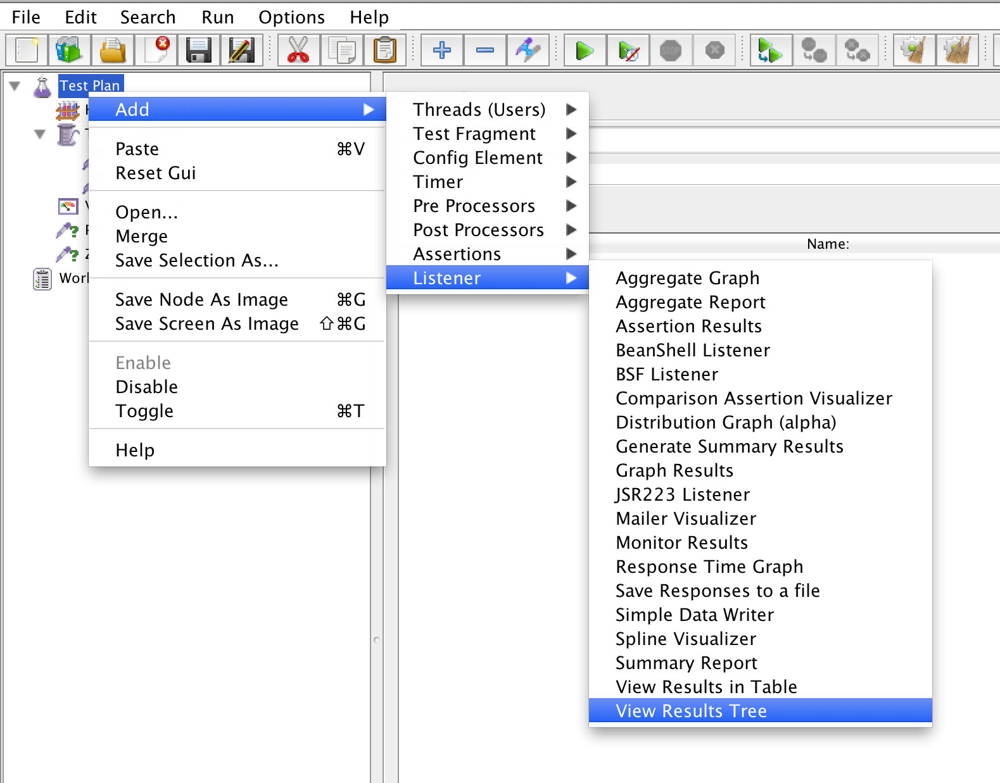
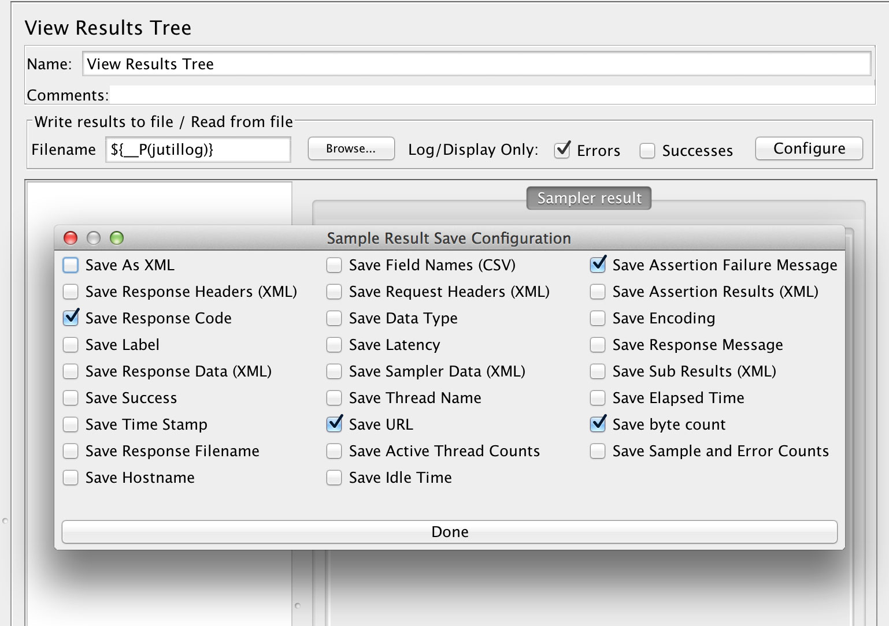

## 概要
ディレクトリを指定して全てjmxファイルを順番に実行し、エラーが有った場合、エラー内容を出力しExitCode`1`で終了する、エラーハンドリング機能を提供します。

### オプションと引数
```sh
./jmeter.sh -j /home/admin/apache-jmeter-2.10 -o '-Jdomain="www.example.com"' /home/admin/jmeter
```

#### 引数
実行したいjmxが入っているディレクトリを指定します。直下だけでなく深い階層も検索します。

#### jオプション
jmeterのホームディレクトリを指定します。このディレクトリから`bin/jmeter`を実行します。

#### oオプション
jmeterに渡すオプションを指定します。jmxファイルに渡したい引数がある時に利用して下さい。このオプションはそのまま引数に文字列で渡され`eval`で実行されますので、WEBなど不特定多数が値を渡せるようなコードを書く時は注意して下さい。

### エラーハンドリングの仕組み
エラーハンドリングにはjmeterのログ書き出し機能を利用します。指定したファイル名でログが書き出された場合エラーと見なし、そのログを表示する仕組みになています。このスクリプトでは一つのjmxファイルに対して一つのログを想定していますので、全てのスレッドで共通の`View Results Tree`、つまり、一番上の階層に一つ作成して下さい。



#### ログファイルのファイル名
ログのファイル名は同時に実行されても被らないようにスクリプトから生成して渡されます。
jmeterをコマンドラインから実行する時、jmxに引数から値を与えることが可能で、この機能を利用してログファイル名を渡しています。

```shell
/bin/sh jmeter -n -Jname="value" sample.jmx
```

`-J（大文字）`の後に続けて名前と値を指定します。この`value`はjmx内で`${__P(name)}`で参照可能です。

#### ログ書き出しの準備
jmxに追加した`View Results Tree`のログ書き出しをエラー時のみONにして、ファイル名は引数から受け取るよう`${__P(jutillog)}`に設定して下さい。

ログの出力内容は`Configureボタンで設定可能です。どのような内容でもこのスクリプトの動作には影響ありませんが、沢山出力するとかえって見づらくなります。


